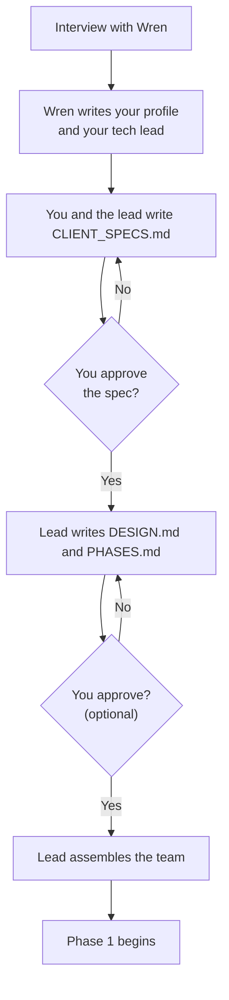
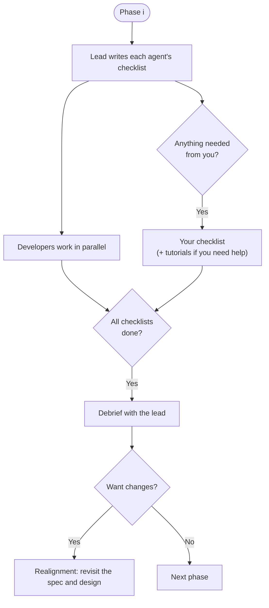

# Consultancy

A small software consultancy made of AI agents. You're the **client**. You
describe what you want, approve the plan, and handle a few simple tasks. A
team of agents designs and builds it. You never have to read or write code
unless you want to.

It runs on [Claude Code](https://claude.com/claude-code) with a $20/month
Claude subscription.

## Contents

- [Why it's built this way](#why-its-built-this-way)
- [Who's who](#whos-who)
- [How a project runs](#how-a-project-runs)
  - [1. Onboarding (happens once)](#1-onboarding-happens-once)
  - [2. The phase loop (repeats until done)](#2-the-phase-loop-repeats-until-done)
- [Getting started](#getting-started)
- [Your responsibilities](#your-responsibilities)
- [Getting the most out of it](#getting-the-most-out-of-it)
- [Where things live](#where-things-live)
- [Ground rules the agents follow](#ground-rules-the-agents-follow)

---

## Why it's built this way

Asking one AI agent to build a whole project in one long chat tends to go
wrong in predictable ways. This consultancy is set up to avoid them.

- **Big jobs are split up.** Some projects are too large for one agent.
  Here, work is divided into phases, and each phase is divided into
  checklists that several agents work through at the same time.
- **Each agent has one job.** An agent that tries to be architect, reviewer
  and programmer at once has too much in its head, and its work gets worse
  the longer it goes on (this is called *context rot*). Every agent here has
  a single role and only reads what that role needs.
- **Documents carry the project, not your prompts.** You don't need to be
  good at prompting. The quality comes from a small set of documents written
  early on: a spec you approve, a design, a plan and per-agent checklists.
  Every agent knows what "done" looks like before it starts.
- **You talk to one person.** Like a real consultancy, you deal with the
  lead, not the individual developers. The lead learns to talk to you at
  your level.
- **It's meant to be enjoyable.** Every agent has a human name and a
  personality.

## Who's who

| Role | Who they are | What they do | Do you talk to them? |
|---|---|---|---|
| **Consultancy Representative** | Wren | Interviews you, then picks and writes a tech lead who suits you and your project | Yes, at the start, and whenever the lead's style isn't working for you |
| **Technical Lead** | Named and chosen with you during the interview | Writes the spec, design and plan with you; builds and runs the team; reviews their work. Writes no code | Yes, for the rest of the project |
| **Developers** (up to 4) | Named by the lead | Write the code, each from their own checklist | No |
| **You** | The client | Approve the spec, handle accounts and keys, do your checklist, join debriefs | — |

## How a project runs

### 1. Onboarding (happens once)



- **`CLIENT_SPECS.md`** says *what* you want, in plain terms. It's the
  contract for the project, and **you must approve it**.
- **`DESIGN.md`** says *how* it will be built: system diagrams, how the code
  is organized, and the style guide. How closely you review it is up to you.
- **`PHASES.md`** is the high-level plan: every phase and who's involved in
  each one.

The step-by-step version for your project is written to
`docs/procedures/ONBOARDING.md` during the interview.

### 2. The phase loop (repeats until done)



At the end of every phase, the lead debriefs you: what got done, what it
means for you, what's next and any risks. That's your moment to ask for
changes, which is called a **realignment**.

## Getting started

**You need:** Claude Code installed, and a Claude subscription.

1. Open a terminal in this `Consultancy/` folder and start the interview:

   ```bash
   claude
   ```

   Wren is the default agent (set in `.claude/settings.json`), so plain
   `claude` starts with them.

2. Chat with Wren. It takes roughly 10–15 exchanges. At the end you'll pick
   your tech lead from two or three candidates.
3. At handoff, Wren offers to make your lead the default. Say yes, and from
   then on plain `claude` opens a session with your lead. (Say no, and you
   start the lead with `claude --agent tech_lead_<name>` instead.)
4. From then on, **every session is with your lead**. Start a fresh session
   whenever you like. The project's state lives in the documents, not in the
   chat, so nothing is lost.

To reach Wren again later, run `claude --agent consultant_rep_wren`. To
change the default yourself, edit the `"agent"` value in
`.claude/settings.json`.

## Your responsibilities

Your tasks are simple, but the project can't move without them:

- **Accounts and API keys.** Create them and store them safely. The lead
  tells you where they go. **Never paste a key or password into the chat.**
- **Approve `CLIENT_SPECS.md`,** and any change to it later.
- **Review** whatever you chose to review during the interview. That's the
  spec at minimum, and the design too if you want.
- **Your checklist,** in `client/checklist.md`, when a phase needs you.
- **Debriefs** at the end of each phase.

## Getting the most out of it

**In the interview**
- **Be candid about your technical level.** There's no wrong answer. It
  decides how your lead talks to you. Overstating it gets you jargon;
  understating it gets you more explanation than you need.
- **Describe the problem, not just the solution.** "I keep missing good
  trades while I'm at work" leads somewhere better than "build me a bot".
- **Say what success looks like.** What would make the first prototype
  feel worth it?
- **Start small.** A focused first version that works beats an ambitious
  one that stalls. Wren will help you trim, and extras can come in later
  phases.
- **Shape your lead.** You pick from the candidates, and you can ask for
  tweaks ("like that one, but more direct").

**During onboarding**
- **Read `CLIENT_SPECS.md` properly.** Everything downstream comes from it,
  and it's much cheaper to fix a misunderstanding here than in phase 3.
- **Pick a review depth you'll actually keep up.** You can always ask the
  lead for a plain-language summary instead of the full design.

**During phases**
- **Do your checklist promptly.** Developers may be waiting on an account or
  key only you can create.
- **Ask for a tutorial** whenever a task is unclear. They go in
  `client/tutorials/`, so you can reuse them.
- **Use the debrief.** Ask "what does this mean for me?" or "can you show me
  it working?"
- **Realign early.** If something's off, say so at the debrief. Changes to
  the spec ripple into the design and plan, and small corrections are
  cheaper than late ones.

**When something isn't working**
- **You don't like *how* the lead works with you** (too much detail, too
  fast, too formal): go back to Wren with
  `claude --agent consultant_rep_wren`. Wren can only adjust the lead's personality. Your spec, design and plan
  are untouched.
- **You don't like *what's* being built:** tell the lead and ask for a
  realignment.

**Stretching the $20 budget**
- **The team is capped at 4 developers,** and the lead plans to fit your
  subscription.
- **Use fresh sessions.** Long chats cost more and get worse. Starting a new
  session with your lead is free of downside, because the documents hold
  the state.
- **If you hit your plan's usage limit,** stop and pick up after it resets.
  Nothing is lost.
- **Go through the lead.** Resist asking for changes by editing files
  yourself. The lead keeps the documents consistent.

## Where things live

```
Consultancy/
├── README.md                  ← you are here
├── .claude/agents/            ← agent profiles
│   ├── consultant_rep_wren.md ← Wren
│   ├── tech_lead_<name>.md    ← your lead (written by Wren)
│   └── <role>_<name>.md       ← developers (written by the lead)
├── client/                    ← everything for you
│   ├── client_<name>.md       ← your profile (from the interview)
│   ├── checklist.md           ← your tasks, one section per phase
│   └── tutorials/             ← step-by-step help
├── docs/
│   ├── high_level/            ← CLIENT_SPECS.md, DESIGN.md, PHASES.md
│   ├── checklists/            ← one checklist per developer
│   └── procedures/            ← ONBOARDING.md
└── build/                     ← the product itself (a git repository)
```

## Ground rules the agents follow

| | Wren | Tech lead | Developers |
|---|---|---|---|
| Talks to you | ✅ | ✅ | ❌ |
| Talks to agents in other repos | ❌ | ✅ | ❌ |
| Writes `CLIENT_SPECS.md` / `DESIGN.md` / `PHASES.md` | ❌ | ✅ (spec changes need your approval) | ❌ |
| Edits the lead's personality | ✅ (and nothing else in that file) | ❌ | ❌ |
| Writes checklists and tutorials | ❌ | ✅ | ❌ |
| Writes code in `build/` | ❌ | ❌ (reviews only) | ✅ |
